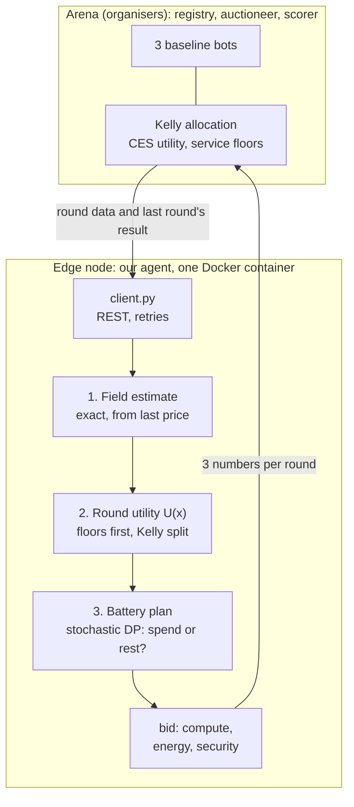
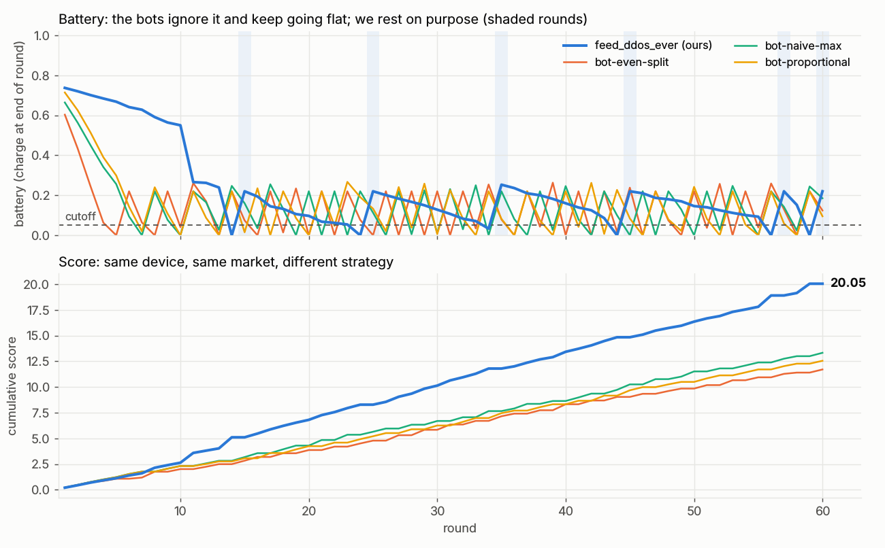
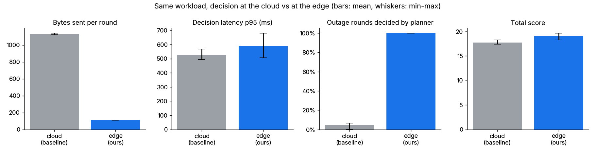

# Second Wind: an edge agent that knows when to rest

**VelesHack 2026, Challenge 4 (CoGNETs):** Dynamic Node Registration and Auction-Based Resource
Allocation in an Edge Computing Environment.

| | |
|---|---|
| Team | **Ekaterina Fedoseeva** (solo), team `feed_ddos_ever` |
| `TEAM_NAME` | `feed_ddos_ever`. It fixes the device profile in the graded run; use it everywhere |
| Dockerfile | `agent-template/Dockerfile`, built with `docker build agent-template` |
| Licence | Apache-2.0, see [LICENSE](LICENSE) |

The challenge brief is in [docs/challenge.md](docs/challenge.md).

## The problem

In a CoGNETs swarm, every edge node bids each round for shares of three scarce pools
(compute, energy, security) under a budget. There is no central scheduler. The trap: the
energy a node *wins* drains its own battery, and a flat battery takes the node out of the
swarm for whole rounds. All three baseline bots ignore this and spend about **a third of every
run asleep**. The arena also injects 503s, 429s and latency.

## Who it's for

The operator of a battery-powered edge device, such as a camera, a phone or a field sensor, that
has to buy shared resources from a swarm on its own. The operator wants the most useful work from a
fixed budget without the node going dark, and without depending on a cloud being reachable.

## How it works



Every decision is made on the node. The arena receives only a 3-number bid per round, plus
heartbeats.

## Run it in 3 commands

Requires Docker with Compose v2 and `make`.

```bash
cp .env.example .env    # then set TEAM_NAME=feed_ddos_ever in .env
make up                 # the arena and three bots; leaderboard at http://localhost:8080
make agent              # our agent joins, plans every round, and logs each decision
```

* **Graded rehearsal:** set `SCENARIO=graded` in `.env`, or run `make graded` before
  `make agent`. That is 60 rounds of 4 s with fault injection.
* **Conformance suite and unit tests:** these run on your own Python, so install first:
  `python3 -m pip install -e . -r agent-template/requirements.txt`. Then run `make check` (the
  organisers' suite, fault injection included) or
  `cd agent-template && python3 -m unittest discover tests`.

## Results

**The outcome, round by round:** [docs/results.md](docs/results.md), generated by
`tools/report.py`. Below is a live graded run in Docker with our `TEAM_NAME`. The bots run on a
copy of our device, so the lines compare strategies, not hardware.



| Live graded run (seed 20261006, 136 injected faults) | Score | Rounds resting | Floor penalties | Missed rounds |
|---|--:|--:|--:|--:|
| **feed_ddos_ever (ours)** | **20.047** | 6 | 0 | 0 |
| bot-naive-max | 13.328 | 21 | 0 | 0 |
| bot-proportional | 12.551 | 20 | 0 | 0 |
| bot-even-split | 11.706 | 24 | 3 | 0 |

The template strategy, replayed on the same seed and device the way the graders do, scores 13.426:
**S/T = 1.49** for this run. S/T is our score divided by the template's on the same seed and
device, which is how the graded run is normalised.

**Strategy, across unseen seeds.** Measured in `tools/sim.py`, which drives the organisers' arena
code in-process and reproduces a live graded Docker run to three decimals for every node (see
`docs/model.md`).

| 200 held-out seeds (never used for tuning), team `feed_ddos_ever` | Template | **Ours** |
|---|--:|--:|
| Score vs template, S/T (mean / worst 10% / worst) | 1.000 | **1.328** / 1.173 / 1.075 |
| Seeds where we beat all three bots | – | **198 of 200** |
| Rounds lost resting on a flat battery (of 60) | 18.8 | **7.3** |
| Floor penalties per run | 1.8 | **0.4** |

| Ablation, 100 tuning seeds (seeds 1–100, team `team-sim`) | S/T |
|---|--:|
| Kelly best-response split only | 1.070 |
| + buy the service floors first | 1.101 |
| + the primer's battery taper | 1.286 |
| **+ our battery DP (submitted)** | **1.357** |
| ours, but the DP plans on one average market | 1.341 |
| ours, but with the primer's field estimator | 1.335 |
| ours, but splitting by weights instead of Kelly | 1.358 |
| upper bound: perfect knowledge of rivals' bids (60 seeds, previous DP version) | about +1% |

**Conformance suite** on the built image: **30/30 functional and 20/20 resilience** on 3 seeds.

**Benchmark: decision at the edge vs in the cloud.** Produced by `bench/run.py`; method and
caveats in [bench/README.md](bench/README.md). Same workload, 3 seeds, a 30 s cloud outage from
round 15. Values are mean (min – max).

| Metric | Baseline: decided in the cloud | Ours: decided at the edge |
|---|---|---|
| Bytes sent by the node per round | 1129 (1121 – 1140) | **109** (109 – 110) |
| Decision latency p50 / p95 (ms) | 229 / 527 | 243 / 590 |
| Outage rounds decided by the planner | 4% (0% – 7%) | **100%** |
| Score earned during the outage | 3.91 (3.77 – 4.14) | **5.03** (4.85 – 5.23) |
| Total score | 17.75 (17.38 – 18.23) | **19.07** (18.25 – 19.65) |
| Events correctly detected | n/a: no event ground truth in this challenge | n/a |



## Strategy write-up

The split is not where the score is; the battery is. An exact Kelly best response ties with
bidding our weights (1.357 vs 1.358 S/T). Even perfect knowledge of rivals' bids adds only about 1%.

Each round, the agent first **reads the field exactly**. The published price is last round's total
bid over *last* round's capacity, so we multiply by that capacity, subtract our own bid, and rescale
to this round's shared budget. The primer's estimator mixes the two rounds and costs 1–2%.

It then **values every candidate energy share x**: the inverse Kelly rule prices the energy bid, both
service floors are bought with a 15% margin, and a Kelly split divides the rest.

Finally it **plans the battery** with a finite-horizon dynamic programme over (rounds left, charge),
drawing future rounds from the last ten market states. Resting is the only way to recharge, so the DP
often drains on purpose in a cheap round, rests for one, and spends its reserve at the end. A
worst-case check stops accidental dips under the cutoff when bots rest and our energy share jumps.
Rounds asleep fall from 18.8 to 7.3.

Two fixes to the shipped loop came from measurement:
- **Results were never collected.** The template asked only for the round it had just bid in, so
  its history stayed empty (21 of 21 requests returned 404).
- **Retry sleeps cost whole rounds.** A full-second sleep on every injected fault meant three faults
  in a row lost a whole round.

What did not work: a DP on one average market (1.341), and changing the floor margin.

Honest cost: we take from our neighbours. Replacing the template with us cuts the bots' total score
by 13% and lowers the swarm's log welfare.

## Limitations

- **Score vs the reference:** the organisers' reference agent is not public, so we can only
  estimate where 1.33 sits on the strategy scale (the README puts the reference about 22% ahead of
  the bots).
- **Unverified physics constants:** the energy drain is learned online. The recharge rate (0.22),
  the idle drain and the cutoff come from the shipped scenarios.
- **When all three bots go flat at once, any energy bid wins the whole pool and can flatten us.**
  It happened in the live run, costing the final round. A check that assumes the field can vanish
  entirely prevents it, but costs more than it saves (S/T 1.315 vs 1.357 on the tuning seeds), so
  we accept the occasional unplanned rest.
- **We don't always win.** On 2 of the 200 unseen seeds, one bot finishes ahead of us.
- **The planner assumes recent markets repeat.** A regime change, such as more agents joining,
  degrades it until its ten-round window refills.
- **Device coverage:** live graded runs covered one device. The 200-seed evaluation covers 200
  devices, but in simulation.
- **Benchmark scope:** the cloud ran on loopback with 2 s rounds and 3 seeds. It shows no latency
  advantage for the edge, and the outage result holds by construction (our agent has no cloud in
  its decision path).
- **We changed provided files:** `agent.py` and `client.py`, for the two measured fixes above. The
  changes are marked "ours" in the code.

## Next steps

1. **Cooperative mode:** optimise the swarm's log welfare (the CoGNETs objective) alongside our own
   score, and measure the trade-off frontier.
2. **Learn more of the physics online:** the recharge rate and the cutoff, so the agent ports to
   other scenarios.
3. **Run on real hardware:** a Raspberry Pi-class device, to measure decision time there. The DP
   takes about 0.1 s in Python and vectorises further.
4. **In the full CoGNETs stack:** swarm discovery and messaging over Eclipse Zenoh.

## Technology

| Required by the challenge | How we use it |
|---|---|
| Docker image | `agent-template/Dockerfile`, Python 3.12, `httpx` and `numpy` pinned |
| REST/JSON with retries and backoff | The template client, with the measured `Retry-After` change |

No Eclipse technology is required by this challenge, so we added none. The graders run our
container against their own HTTP arena. A pub/sub layer such as Zenoh would earn no points and
would add a failure mode to the graded run.

## Repository map

| Path | What it is |
|---|---|
| `agent-template/strategy.py` | **our strategy**: field estimate, floors, Kelly split, battery DP |
| `agent-template/agent.py`, `client.py` | the organisers' loop and client, with our two marked fixes |
| `agent-template/tests/` | unit tests for the strategy |
| `tools/sim.py` | in-process simulator; `--ablation` reproduces the table above |
| `tools/report.py`, `docs/results.md` | the outcome view: records a live run, renders the charts and tables |
| `bench/` | edge vs cloud benchmark, results in `bench/results/` |
| `docs/model.md` | the rules read from the arena source, the simulator's assumptions and its validation |
| `docs/demo-script.md`, `docs/pitch.md` | the 2-minute demo and the 3-slide pitch |
| `arena/`, `baselines/`, `tests/`, other `docs/` | the organisers' environment, unchanged |

Reproduce the numbers (Python 3.10+):

```bash
python3 -m pip install -e . -r agent-template/requirements.txt -r bench/requirements.txt
python3 tools/report.py --heldout 200                   # held-out table and chart (uses TEAM_NAME)
python3 tools/report.py --live http://localhost:8080    # record a run started with make graded / make agent
python3 tools/sim.py --ablation --seeds 100             # ablation
python3 bench/run.py                                    # edge vs cloud, ~15 min
```
