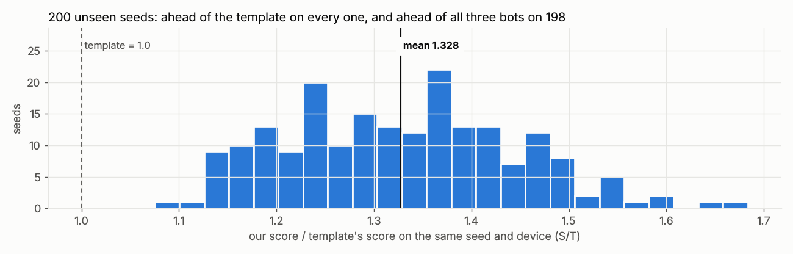

# Results: the challenge outcome

Generated by `python tools/report.py` from the data in `docs/results/`.

## One graded run, round by round

Live graded run in Docker (fault injection on), team `feed_ddos_ever`, seed 20261006, recorded 2026-10-07. The three bots run on a copy of our device, so the lines compare strategies, not hardware.

| Node | Final score | Rounds resting on a flat battery | Floor penalties | Missed rounds |
|---|--:|--:|--:|--:|
| **feed_ddos_ever (ours)** | 20.047 | 6 | 0 | 0 |
| bot-naive-max | 13.328 | 21 | 0 | 0 |
| bot-proportional | 12.551 | 20 | 0 | 0 |
| bot-even-split | 11.706 | 24 | 3 | 0 |

The template strategy, replayed on the same seed and device the way the graders do, scores 13.426: **S/T = 1.493** for this run.

## Across 200 unseen seeds

Simulator (`tools/sim.py`), team `feed_ddos_ever`, seeds 1001–1200; none were used for tuning. Each seed also draws a different device.

| S/T mean | worst 10% | worst seed | best seed | ahead of all three bots |
|--:|--:|--:|--:|--:|
| 1.328 | 1.173 | 1.075 | 1.684 | 198 of 200 |

| Mean per run | Template in our place | Ours |
|---|--:|--:|
| Rounds resting on a flat battery (of 60) | 18.8 | 7.3 |
| Floor penalties | 1.8 | 0.4 |
| The three bots' total score | baseline | -12.9% |
| Swarm log welfare, sum over rounds | baseline | -12.8 |
